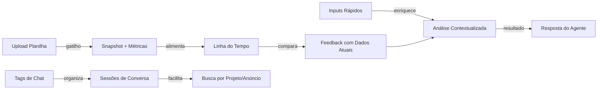

# Plano de Melhorias — Sprint 2026/06

> **Versão:** 1.0 · **Data:** 15/06/2026 · **Produto:** Embaplan — Assistente Inteligente de Performance de Anúncios
> **Status:** Planejamento

---

## 0. Resumo

Quatro melhorias complementares que evoluem o Embaplan de "analista pontual" para "sistema de acompanhamento inteligente":

| # | Melhoria | PRD | Épico Ref. | Prioridade |
|---|---------|-----|------------|------------|
| 1 | **Inputs Rápidos com Contexto** — perguntas guiadas ao usuário antes de analisar | [PRD-1-Inputs-Rapidos.md](./PRD-1-Inputs-Rapidos.md) | Novo | 🔴 Alta |
| 2 | **Evolução de Métricas por Upload** — linha do tempo do lucro médio, ACOS médio, etc. | [PRD-2-Evolucao-Metricas.md](./PRD-2-Evolucao-Metricas.md) | Épico 1 (snapshots) | 🔴 Alta |
| 3 | **Feedback com Dados Atuais** — usar a planilha atual como base de comparação para entender o que mudou | [PRD-3-Feedback-Dados-Atuais.md](./PRD-3-Feedback-Dados-Utuais.md) | Épico 1 + 2 | 🟧 Média |
| 4 | **Tags de Chat** — marcar conversas com tags para filtrar e encontrar discussões sobre projetos/anúncios específicos | [PRD-4-Tags-Chat.md](./PRD-4-Tags-Chat.md) | Novo | 🟧 Média |

---

## 1. Visão Geral das Dependências

### Ordem de Implementação Recomendada

1. **Fase A (2 semanas):** PRD-4 (Tags) + PRD-1 (Inputs Rápidos) — são independentes, baixa complexidade
2. **Fase B (2 semanas):** PRD-2 (Evolução de Métricas) — depende dos snapshots existentes (Épico 1 ✅)
3. **Fase C (1 semana):** PRD-3 (Feedback com Dados Atuais) — depende de PRD-2 + snapshots

---

## 2. Arquitetura Atual (Resumo)

| Camada | Componente | Estado |
|--------|-----------|--------|
| Front-end | `front.html` — chat, dashboard, sessões, upload | ✅ Funcional |
| Banco | Supabase — `embaplan_chat_message`, `embaplan_analysis_snapshot`, `embaplan_recommendation` | ✅ Migrations 008–012 |
| Orquestração | n8n — `Embaplan - Agent IA`, sub-fluxo planilha, upload | ✅ Funcional |
| Histórico | Snapshots versionados por upload, timeline, overview, recomendações | ✅ Entregue |

---

## 3. Critérios Globais de Sucesso

| KPI | Meta |
|-----|------|
| Tempo para o usuário preencher contexto antes de uma análise | ≤ 30s (inputs guiados) |
| Clique para ver evolução de métricas de um anúncio | ≤ 2 cliques |
| Tempo para encontrar um chat anterior sobre um anúncio específico | ≤ 10s (com tags) |
| Fidelidade dos dados de comparação (atual vs. anterior) | 100% (mesma fonte: planilha) |
| Satisfação do usuário com a fluidez da experiência | Qualitativa (NPS) |

---

## 4. Riscos e Mitigações

| Risco | Impacto | Mitigação |
|-------|---------|-----------|
| Inputs rápidos podem não cobrir todos os cenários | Médio | Campo livre opcional em cada etapa |
| Dados da planilha variam entre lojas/formatos | Alto | Validar presença de colunas obrigatórias antes de processar |
| Tags acumuladas sem governança | Baixo | Autocomplete + limitar a 5 tags por chat |
| Snapshots antigos consomem espaço | Baixo | Retenção de N versões por anúncio (já planejado no Épico 1) |
